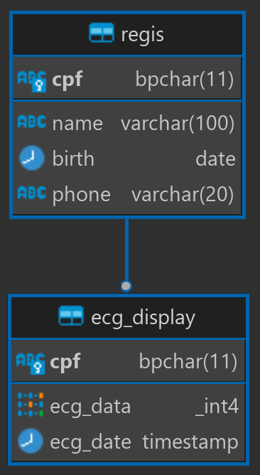

# fake-ecg-angularjs
Fake ECG project in angularjs nodejs and postgreSQL

## Database


## Demo
https://drive.google.com/file/d/1_878roeU_hJPNIUDepr8CehWXfrg0Y57/preview

# Environment Setup

This application uses the following environment variables for configuration with a Postgres database. These variables need to be set in a .env file at the root of your project before running the application.

- **POSTGRES_HOST:** The hostname of your Postgres database. For example, 'localhost' if your database is running on your local machine.

- **POSTGRES_PORT:** The port number on which your Postgres database is listening. By default, Postgres runs on port 5432.

- **POSTGRES_DB:** The name of the database you want to connect to.

- **POSTGRES_SCHEMA:** The name of the schema in your database that you're using.

- **POSTGRES_USER:** The username of your Postgres database account.

- **POSTGRES_PASSWORD:** The password for your Postgres database account.

## How to set environment variables

Sure, here is a modified version of the instructions that specifies using a `.env` file.

## Creating a `.env` File

To set these environment variables:

1. Create a new file in the root of your project named `.env`.
2. Open this file in your text editor.
3. Add the environment variables, one per line, using the format `VARIABLE_NAME=VALUE`.

Here's an example of what your `.env` file might look like:

```
POSTGRES_HOST=localhost
POSTGRES_PORT=5432
POSTGRES_DB=mydatabase
POSTGRES_SCHEMA=public
POSTGRES_USER=myusername
POSTGRES_PASSWORD=mypassword
```

Make sure to replace `localhost`, `5432`, `mydatabase`, `public`, `myusername`, and `mypassword` with the actual values for your environment. If you're unsure of these values, you'll need to get them from your database administrator or hosting provider.

# Running the Application

The application consists of two main parts, the backend server, and the frontend client. Each has different steps to get up and running.

## Running the Backend

The backend of the application consists of a Node.js server using HTTP methods through Express and WebSocket with ws.

From the root of the project directory, to start the backend, first navigate to the `back` directory and run:

```bash
cd back
node ws_app.js
```

Please note that this will start the server on port 3000 for HTTP and port 8008 for WebSocket.

## Running the Frontend

The frontend of the application is an AngularJS 1.8.3 application with Materials.

To run the frontend, you can use a web server extension on your code editor. For example, if you're using Visual Studio Code, you could use the "Live Server" extension. If you're using JetBrains WebStorm, you can use the built-in "Run" functionality.

The exact steps may vary depending on your chosen extension or code editor. However, the common approach would be to navigate to the `front` directory and then activate your web server:

```bash
cd front
```

Remember to run your web server on a port that isn't already being used. The backend is already using ports 3000 and 8008.

# Technologies Used

This project uses the following main technologies:

- Frontend: AngularJS 1.8.3 with Angular Materials
- Backend: Node.js (version 20.4.0) with Express for HTTP methods and ws for WebSocket communication
- Database: PostgreSQL

You can set up a PostgreSQL instance in a Docker container with the following commands:

```bash
docker pull postgres
docker run --name my-postgres -e POSTGRES_PASSWORD=mysecretpassword -p 5432:5432 -d postgres
```

Replace `mysecretpassword` with your actual database password. You can set the relevant environment variables in the `.env` file, as described above.

**Note:** `.env` is in `.gitignore`
